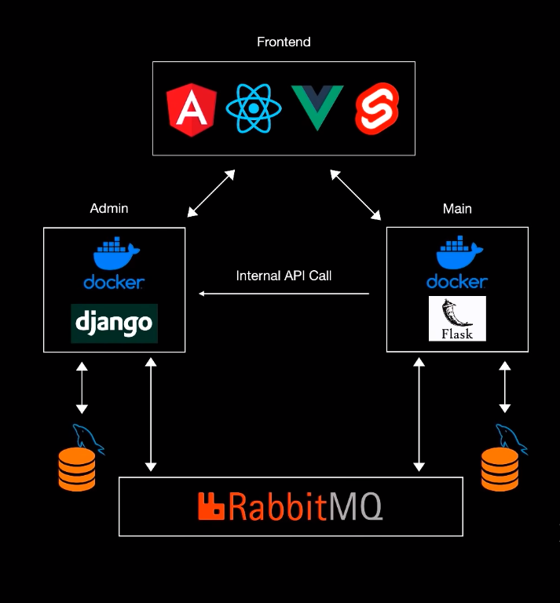

# Micro-Services-Django-Flask-React

Welcome to the Micro-Services-Django-Flask-React project! This project revolves around creating microservices for a dynamic product store.


## Architecture Overview



## Overview

The back-end is comprised of two essential services:

1. **Admin Service:** Manage your products effortlessly! Create, update, and delete products seamlessly.
2. **Main Service:** Allow users to express their interest by liking their favorite products.

## Communication Between Services

For seamless communication between services, RabbitMQ has been integrated into the architecture. This ensures efficient message passing and coordination between the Admin and Main services.

## Database

MySQL has been utilized as the database for this project. Separate databases have been created for each service to ensure efficient data management.


## Frontend Technologies

The frontend is developed using a modern tech stack:

- React
- HTML
- CSS
- Bootstrap

Enjoy an intuitive and responsive user interface to interact with your microservices.


## Deployment

We've leveraged the power of containerization and cloud services for a seamless deployment experience. The technologies used include:

- **Docker:** Containerize your application for consistent and reliable deployment.
- **Docker-compose:** Simplify multi-container application management with easy orchestration.
- **Azure Virtual Machine:** Take advantage of the cloud for efficient scaling and accessibility.

## Getting Started

1. **Clone the Repository:**
   ```bash
   git [https://github.com/hafid34bba/Micro-Services-Django-Flask-React](https://github.com/hafid34bba/Micro-Services-Django-Flask-React).git
